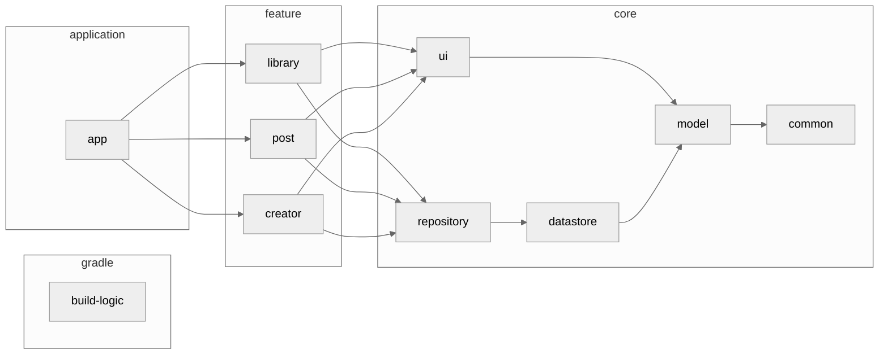

# 作ったアプリ
pixivFANBOXというクリエイター支援プラットフォームの非公式クライアントアプリを作成しました。オープンソースで開発しており、以下のGitHubリポジトリで公開しています。

https://github.com/matsumo0922/PixiView

Androidのみの開発となっていますが、好評であればiOS版の開発も検討しています。GooglePlayでの公開もしており、Androidを使っているFANBOXユーザーの方はぜひインストールしてください。

https://play.google.com/store/apps/details?id=caios.android.fanbox&hl=ja&gl=US

# 開発時の話
そもそも、このアプリを開発しようとしたきっかけはFANBOXのイラストをスマホで堪能したかったからです。FANBOXのサイトはレスポンシブでスマホ向けにUIが最適化されていますが、それでもネイティブアプリに快適性で勝ることはできません。

FANBOXの運営であるPixiv株式会社は他にPixivというイラスト投稿サービスを運営していますが、こちらの方はネイティブアプリ版が存在するのに、FANBOXのアプリはなくてなんとなく不思議でした。Twitterで検索しても疑問やアプリを求める要望の声が結構あったみたいです。

https://x.com/shiyu_9408z/status/1728359205462253611?s=20

そこで一念発起、FANBOXのクライアントアプリを作りそこに付加価値（一括ダウンロードや通知機能など）をつけて公開すれば、結構な反響があるのでは！？と思い作り始めた次第です。結果、アプリは完成し広告をしたことでそこそこな数の反響をいただいたので、それを綴っていこうかなと思います。

## 機能
あくまで自分が使いやすいように作っているので、一部のユーザーには不満なこともあるかもしれません。GitHub issueやGooglePlayの方にレビューをいただけたら検討するので、どしどし意見してください！

- FANBOXの主要機能全て
    - フォローしているクリエイターの投稿TL
    - 支援しているクリエイターの投稿TL
    - 指定したクリエイターの投稿TL
    - 投稿詳細
    - クリエイター詳細
    - 投稿のいいね
    - コメントの追加・削除・いいね
    - 通知一覧
    - メッセージ一覧
- 独自機能
    - 投稿に含まれるイラストの一括ダウンロード
    - 指定したクリエイターが過去投稿した全ての投稿の一括ダウンロード
    - 新着通知（ネイティブ）
    - 上位プランでの投稿など見れない投稿をTLから非表示
    - 写真アプリのようなグリッド表示
    - アプリロック
- 作りたい
    - ウィジェット
    - Pixiv APIと合わせて色々やりたい

## API解析
PixivのAPIといえばpixivpyが有名ですが、FANBOXのAPIラッパーはほぼ存在していませんでした。そのため、実際にFANBOXのサイトを行ったり来たりして投げているAPIを地道に確認していくしかなく、ほぼ苦行でめちゃくちゃ辛かったです。ですが、なんとかアプリとして構成できる分のAPIを得ることができましたので、メモ書き程度にここに書いておきます。

エンドポイントのルートは`https://api.fanbox.cc`です。また、Cookieに`FANBOXSESSID`という値を指定する必要がありますが、この値を得る方法は調べていないので、ユーザーに自分で設定してもらうか、WebViewなどでログインしてもらうなどして取得する必要があります。今回のアプリでいえば以下のあたりです。ユーザーにWebViewでFANBOXにログインしてもらい、リダイレクトする際のCookieを取得して保存しています。以降はこのCookieを使ってAPIにアクセスし、更新があったら新たなCookieを保存する形です。

https://github.com/matsumo0922/PixiView/blob/8f3a2f28beade79d129cd7ffa99615fd43bda6a4/feature/welcome/src/main/java/caios/android/fanbox/feature/welcome/login/activity/LoginScreen.kt#L70-L77

:::message
ここに書かれている情報は2023年12月23日時点の情報です。また、APIの利用はpixivFANBOXの利用規約を遵守して使用するようにしてください。この情報を元に行われた一切の行為に私は責任を持ちません。
:::

|パス|パラメータ|使用目的|
|-|-|-|
|`post.listHome`|limit,maxPublishedDatetime,maxId|フォローまたは支援しているクリエイターの投稿タイムライン|
|`post.listSupporting`|limit,maxPublishedDatetime,maxId|支援しているクリエイターの投稿タイムライン|
|`post.listCreator`|limit,maxPublishedDatetime,maxId,creatorId|指定したクリエイターの投稿タイムライン|
|`post.listTagged`|tag,page,creatorId|指定したタグが含まれる投稿一覧|
|`post.paginateCreator`|creatorId|クリエイターの投稿を10個ずつに分けた`post.listCreator`のリスト|
|`creator.search`|q,page|キーワードに一致するクリエイターのリスト|
|`tag.search`|q|キーワードに一致するタグのリスト|
|`post.info`|postId|投稿詳細|
|`post.listComments`|postId,offset,limit|投稿に含まれるコメントのリスト|
|`post.likePost`|postId|投稿をいいね|
|`post.likeComment`|commentId|コメントをいいね|
|`post.addComment`|postId,rootCommentId,parentCommentId,body|コメントを追加|
|`post.deleteComment`|commentId|コメントを削除|
|`follow.create`|creatorUserId|クリエイターをフォロー|
|`follow.delete`|creatorUserId|クリエイターのフォローを解除|
|`creator.listFollowing`||フォローしているクリエイターの一覧|
|`creator.listPixiv`||Pixivでフォローしているクリエイターの一覧|
|`creator.listRecommended`|limit|おすすめのクリエイター|
|`creator.get`|creatorId|クリエイター詳細|
|`tag.getFeatured`|creatorId|クリエイタータグ|
|`plan.listSupporting`||支援中のプラン一覧|
|`plan.listCreator`|creatorId|クリエイターのプラン一覧|
|`newsletter.list`||メッセージ一覧|
|`bell.list`|page,skipConvertUnreadNotification,commentId|通知一覧|

このAPIにKtorでアクセスするメソッドをまとめたのが以下の`FanboxRepository`になります。コードはGitHub上でGPLライセンスで配布しているので、配布元を明記していただければコピぺOKです。

https://github.com/matsumo0922/PixiView/blob/master/core/repository/src/main/java/caios/android/fanbox/core/repository/FanboxRepository.kt

## 技術スタック
モダンなAndroidアプリであればどこでも採用しているような構造をしています。イラスト鑑賞がメインとなるアプリであることから、タブレット対応が容易にできる**Full Compose**を基本として以下のような技術（ライブラリ）を使用しています。

- Kotlin
    - Kotlin Coroutines
    - Kotlin Flow
    - Kotlinx Serialization
- Jetpack
    - Jetpack Compose
    - Jetpack Navigation
    - Jetpack Glance
- Material3 / Material You
- Ktor
- [Detekt](https://detekt.dev/docs/intro)
- [Daifuku](https://github.com/cookpad/daifuku)
- [Puree](https://github.com/cookpad/puree-kotlin)

また、ユーザー体験の連続性という観点からあらゆる箇所で**Paging3**を用いたページネーションを導入しています。FANBOXのAPIは`limit`というパラメーターで一回のレスポンスに含まれる量を調整できるので、FANBOXのサーバーに負荷をかけることなく必要な分だけのページネーションを実現できています。

アプリの構造としてはよくある4レイヤーに分割されたマルチモジュールプロジェクトで、**build-logic**というモジュールでGradleの**Convention Plugin**を用いたビルド設定の共通化を行なっています。また、Daifuku,Pureeを用いたテキストベースのログ管理を行なっています。

### Detektはいいぞぉ（余談）
これはマジで余談なのですが、このプロジェクトはlinter&Formatterとして[Detekt](https://detekt.dev/docs/intro)を採用しています。一昔前まではktlintなどのlinterが有名でしたが、そのktlintラップしつつフォーマットエラーやコードスメルなどを検知できる、**完全上位互換**としてDetektは君臨しています。

追い打ちをかけるように[IntelliJプラグイン](https://plugins.jetbrains.com/plugin/10761-detekt)が提供されており、コードを書いている最中から自動で静的解析が走り、エラーを報告してくれます。もうこれはDetektに乗り換えるしかないね！

現状コントリビューターは自分一人なので活用は全くできていないのですが、将来コントリビューターが増えることを祈ってGitHub Actionsを用いたPR上でのフォーマットエラーの指摘を行っています。Detektを強制することで、masterのコードが一定の規則に基づいてフォーマットされることになり、自分でも非常に読みやすいですし、他の方もコントリビュートしやすいと思って、自分が作っているプロジェクトはDetektでないにしろ必ずlinterとFormatterを導入しています。

|PR上で指摘されている様子|
|-|
||

### Daifukuはいいぞぉ（余談）
これはマジで余談なのですが（2回目）、このプロジェクトでは[Daifuku](https://github.com/cookpad/daifuku)というテキストベースでログ定義を管理できるライブラリを導入しています。このライブラリはMarkdownでログ定義を書いた後に、それを基にKotlinコードないしSwiftコードを自動生成してくれるライブラリで、ログのドキュメントを残すという作業を自動化してくれるライブラリです。

あとで使うと思ってログを残しておくことは多々あると思いますが、そのログが何を示しているのか何のために存在しているのか、人間なならば必ず忘れてしまうものです。そうならないためにドキュメントを残すのですが、僕のような雑な人間にはいちいちドキュメントを残すなどという作業はできません。そこでこのDaifukuを導入することによって、ログを実装すると同時にドキュメントを残すことを可能にしています。

将来的にiOS版の開発も予定していると序盤に書きましたが、このDaifukuを導入していることでログ定義の共通化も行うことができます。同じMarkdownから複数の言語でコードを自動生成できるのもこのライブラリの良いところです。

↓Daifukuによって自動生成されたコード
https://github.com/matsumo0922/PixiView/blob/master/core/logs/src/main/java/caios/android/fanbox/core/logs/category/NavigationLog.kt

## デザイン
イラスト閲覧がメインとなるアプリなので第一にスムーズにイラストを閲覧できること目標にしています。投稿詳細画面ではPixivアプリを模倣して、タイトルや説明・クリエイター名などよりもより優先してファーストビューがイラストとなるようにデザインしました。

アプリオリジナルの機能としてグリッドモード（一覧表示モード）があります。これは私の「イラストだけをスムーズに見たい」という欲望が具現化した機能で、写真アプリやアルバムアプリのようにイラストがグリッド表示される機能です。イラストのサムネイルがずらっと表示されるので一覧性が高く、非常に満足している機能でもあります。

|投稿詳細|通常TL|グリッドモードTL|
|-|-|-|
||||

また、このアプリの収益化の一部としてGoogle AdMobによる広告があります。正直言って最近AdMobが推し進めているアプリ起動時広告や全画面広告には猛烈に反対の立場で、せっかくアプリを利用してくれているユーザーの操作を阻害するように広告の出し方には納得できません。

とは言っても広告を全く出さないと収益化もできないので、アプリのUIに沿ったカード型のネイティブ広告を導入しています。ネイティブ広告は広告のUIをこちら側で決定できるので、投稿一覧画面などカードが並んでいる部分に紛れさせて出すことで、ユーザーの操作や認識を阻害することなく、さりげなく広告を掲出することが可能です。

|TLでの広告表示|投稿詳細での広告表示|
|-|-|
|||

アプリのアイコンやPlayストアに載せているスクリーンショットはココナラでデザイナーさんに作成していただきました。最初はPowerPointを用いて自分で作成しようとしていたのですが、自分のデザインセンスのなさに絶望して依頼した次第です。特にアプリアイコンやスクショは外部流入者が一番に目にする場所で、アプリの印象や流入量に直結する部分なのでデザイナーさんを雇ってちゃんとしたものを掲載すべきだと考えています。

https://coconala.com/services/1988542

# Google広告でアプリを宣伝
せっかくアプリを開発しても、ユーザーに知って貰えなければそれで終わりです。とは言えGooglePlayに出して放置しておくだけでも良アプリであれば自然とユーザーは集まりますし、時間をかければユーザーがユーザーを呼んで徐々にインストール数が増えていきます。しかしそれは時に年単位の時間を要し、せっかくアプリを作ったのに熱が冷めてしまった頃にインストール数が伸び始めても元も子もないです。

そこで、今回はGoogle広告を用いてアプリの宣伝をやってみることにしました。自分としても初めての試みで、Google広告というプラットフォームを使いこなせている訳ではないので宣伝効果はイマイチ最適化できませんでしたが、その結果を書いておこうかなと思います。

## 予算とターゲット
広告にはお金がかかります（当たり前）。Google広告では「日ごとの予算」という形で、1日にこれくらいの金額を使うように広告を掲出する設定ができます。実際に使われる金額は日によって予算の半分であったり2倍であったりするのですが、月の合計が日ごとの予算×31を超えることはないように調整されます。実は以前作った[Kanade](https://play.google.com/store/apps/details?id=caios.android.kanade)という音楽プレイヤーアプリの広告収入＋課金収入でそこそこの金額が蓄えられたので、今回は日に5000円でチャレンジしてみようと思います。

https://play.google.com/store/apps/details?id=caios.android.kanade

また、広告を掲出するターゲットを絞ることも重要です。FANBOXは日本の会社が運営しているサービスですから、当然日本人のユーザーが多くなります。と思いきや、[公式が発表しているデータ](https://official.fanbox.cc/posts/5707317)ではFANBOXを利用しているユーザーの40%が海外からのアクセスのようです。国別に見ていくと、中国・アメリカ・韓国がTop3となっています。そこで今回は日本・中国・アメリカ・韓国の4ヵ国に絞って広告を出してみたいと思います。

## 効果
とりあえず2週間広告を掲載してみました。途中予算や目標CV値を弄ったり、支払いを忘れて数時間広告掲出が止まったりとデータが変動する要因が多々あったので参考になるかどうかはわかりませんが、広告の表示回数とクリック率のグラフを載せておきます。序盤だけ異様に値が高いのは予算を1万円にしていたからです。さすがにお財布へのダメージが大きかったので途中から5000円に変更しています。

クリック数が1万弱でCVが2000程となっているので、どうでしょう。あまり効果的だったとは言えないのかなぁというのが個人的な感想です。クリック率が3%を超えればいい方と言われるGoogle広告の中で3.44%を記録できているので、広告自体は魅力的に映ったと思われますが、そうであってもアプリのインストールというCVにはなかなか繋がらないのが現状です。広告の誤クリックも多いでしょうし、6万円かけたわりには微妙ですかね。

また、注目して欲しいのがCV単価です。ここでは34円となっていますが、国別に見ると日本が**106円**（！？）でアメリカが**27円**、韓国が**25円**、中国が**18円**となっていました。一瞬だけ全世界に広告を掲出した時があったのですが、その時記録したアフリカやアジア系（特にインドやバングラデシュ）はさらに低く、安く広告を掲載できることがわかります。

↓日本のユーザーだけ全く伸びていない様子（単価が高くて今回設定した予算では競り負けている）

https://x.com/matsumo0922/status/1735281433504362524?s=20

ここから何が言えるかというと、**インストール数を増やすだけの目的なら先進国だけにターゲットを絞るのはやめておいた方が良い**ということです。1クリックの価値が先進国だけやたら高いので、アフリカやアジアの国々にも広告を掲出すれば、同じ予算でも倍以上のCVになります。とはいえ、広告の効果（アプリの継続率や収益性など）の観点から見れば、インドやバングラデシュの方々が今回のアプリを継続的に利用してくれるかどうかと言われれば微妙であるので、今回ターゲットしたように効果が見込める国々に絞るべきでもあります。

広告効果を最大化するには、この辺りの調整を上手い具合に行わないと行けないのでしょう。でなければ今回のように無駄にお金を多く支払うことになります。今回は経験と割り切っていたのですが、正直痛い出費でしたね。ですが、せっかくアプリを作ったのですから、限られた予算の中でより多くのユーザーにアプリを届けるために調整を続行しようと思っています。続報があれば追記します。

### 予算を引き上げませんかという甘い誘い（余談）
これはマジで余談なのですが（3回目）、Google先生がやたら「予算を引き上げませんか？」という甘い誘いを行ってきます。「このままじゃ全然効果的じゃないよ？」「予算を上げたら僕がもっと最適に広告を掲載するよ？」と何回も通知を行ってくるのですが。初めに言っておきます、**この誘いに乗っては絶対にいけません**。

一度予算を引き上げれば最後、「こいつはゴネれば予算を引き上げるやつ」と認識されて無限に予算を引き上げさせられます。Google広告を熟知し、こちらがGoogle広告を操れる立場ならいいのですが、初心者で右も左も分からないような方（特に私）は**絶対に誘いに乗らない**ようにしましょう。

このUXも邪悪だなという感じがするのですが、以下の「適用」ボタンを押すと何の確認もなく予算が引き上げられるんですよね。引き上げた感がないというかお金を失っている感じがしないというか。初めてクレジットカードを使ったあの時の感じに似ています。私はもう二度とこの誘いに乗らないと魂に誓いました。

|1回目の甘い誘い|調子に乗らせてしまった2回目の誘い|
|-|-|
|||

# 終わりに
今回はモダンな技術をフル活用してアプリを作り、さらにそれを宣伝してみるということをやりました。

ずっと作りたかったFANBOXのアプリを作れて個人的には非常に満足しています。モダンな技術をフル活用したことでポートフォリオ的な側面も兼ね備えていますし、OSSとして開発しているのでForkされた先のリポジトリで中国語の訳文が追加されているのも確認しました。PRが来るのを今か今かと待っていますw

宣伝の効果はイマイチありませんでしたが、スタートダッシュを決められたのは大きいと思っています。アプリの場合インストール数が増えれば増えるほど指数関数的に流入量が増えていくので、0→1000程度までならお金を払って広告する価値は十分にあるでしょう。今後もアプリ開発に活かして行ければいいですね。

最後までご覧いただき、ありがとうございました。

https://github.com/matsumo0922/PixiView

https://play.google.com/store/apps/details?id=caios.android.fanbox
